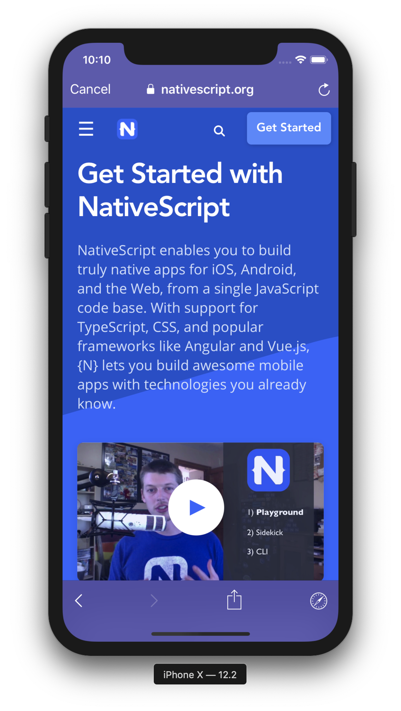

<p align="center">
  <a href="./LICENSE">
    
  </a>
  <a href="https://npmjs.org/package/nativescript-inappbrowser">
    
  </a>
  <a href="https://travis-ci.org/proyecto26/nativescript-inappbrowser">
    
  </a>
  <a href="https://github.com/proyecto26/nativescript-inappbrowser/graphs/commit-activity">
    
  </a>
  <a href="https://tidelift.com/subscription/pkg/npm-nativescript-inappbrowser?utm_source=npm-nativescript-inappbrowser&utm_medium=referral&utm_campaign=readme">
    
  </a>
  <a href="https://opencollective.com/proyecto26" alt="Financial Contributors on Open Collective">
    
  </a>
  <a href="https://npmjs.org/package/nativescript-inappbrowser">
    
  </a>
  <a href="https://npmjs.org/package/nativescript-inappbrowser">
    
  </a>
  <a href="https://twitter.com/intent/follow?screen_name=jdnichollsc">
    
  </a>
</p>

<h1 align="center">InAppBrowser for NativeScript</h1>
<h4 align="center"><a href="https://developer.chrome.com/multidevice/android/customtabs#whatarethey">Chrome Custom Tabs</a> for Android & <a href="https://developer.apple.com/documentation/safariservices">SafariServices</a>/<a href="https://developer.apple.com/documentation/authenticationservices">AuthenticationServices</a> for iOS.</h4>

<p align="center">
  
</p>

## Getting started

```javascript
tns plugin add nativescript-inappbrowser
```


## Usage

Methods       | Action
------------- | ------
`open`        | Opens the url with Safari in a modal on iOS using **SFSafariViewController**, and Chrome in a new custom tab on Android. On iOS, the modal Safari will not share cookies with the system Safari.
`close`       | Dismisses the system's presented web browser.
`openAuth`    | Opens the url with Safari in a modal on iOS using **SFAuthenticationSession/ASWebAuthenticationSession**, and Chrome in a new custom tab on Android. On iOS, the user will be asked whether to allow the app to authenticate using the given url **(OAuth flow with deep linking redirection)**.
`closeAuth`   | Dismisses the current authentication session.
`isAvailable` | Detect if the device supports this plugin.

### iOS Options

Property       | Description
-------------- | ------
`dismissButtonStyle` (String)        | The style of the dismiss button. [`done`/`close`/`cancel`]
`preferredBarTintColor` (String)     | The color to tint the background of the navigation bar and the toolbar. [`white`/`#FFFFFF`]
`preferredControlTintColor` (String) | The color to tint the control buttons on the navigation bar and the toolbar. [`gray`/`#808080`]
`readerMode` (Boolean)               | A value that specifies whether Safari should enter Reader mode, if it is available. [`true`/`false`]
`animated` (Boolean)                 | Animate the presentation. [`true`/`false`]
`modalPresentationStyle` (String)    | The presentation style for modally presented view controllers. [`automatic`/`none`/`fullScreen`/`pageSheet`/`formSheet`/`currentContext`/`custom`/`overFullScreen`/`overCurrentContext`/`popover`]
`modalTransitionStyle` (String)      | The transition style to use when presenting the view controller. [`coverVertical`/`flipHorizontal`/`crossDissolve`/`partialCurl`]
`modalEnabled` (Boolean)             | Present the **SafariViewController** modally or as push instead. [`true`/`false`]
`enableBarCollapsing` (Boolean)      | Determines whether the browser's tool bars will collapse or not. [`true`/`false`]

### Android Options
Property       | Description
-------------- | ------
`showTitle` (Boolean)   | Sets whether the title should be shown in the custom tab. [`true`/`false`]
`toolbarColor` (String)           | Sets the toolbar color. [`gray`/`#808080`]
`secondaryToolbarColor` (String)  | Sets the color of the secondary toolbar. [`white`/`#FFFFFF`]
`enableUrlBarHiding` (Boolean)    | Enables the url bar to hide as the user scrolls down on the page. [`true`/`false`]
`enableDefaultShare` (Boolean)    | Adds a default share item to the menu. [`true`/`false`]
`animations` (Object)             | Sets the start and exit animations. [`{ startEnter, startExit, endEnter, endExit }`]
`headers` (Object)                | The data are key/value pairs, they will be sent in the HTTP request headers for the provided url. [`{ 'Authorization': 'Bearer ...' }`]
`forceCloseOnRedirection` (Boolean) | Open Custom Tab in a new task to avoid issues redirecting back to app scheme. [`true`/`false`]

### Demo

```javascript
import { openUrl } from 'tns-core-modules/utils/utils'
import { alert } from 'tns-core-modules/ui/dialogs'
import InAppBrowser from 'nativescript-inappbrowser'

...
  openLink = async () => {
    try {
      const url = 'https://www.google.com'
      if (await InAppBrowser.isAvailable()) {
        const result = await InAppBrowser.open(url, {
          // iOS Properties
          dismissButtonStyle: 'cancel',
          preferredBarTintColor: '#453AA4',
          preferredControlTintColor: 'white',
          readerMode: false,
          animated: true,
          modalPresentationStyle: 'fullScreen',
          modalTransitionStyle: 'partialCurl',
          modalEnabled: true,
          enableBarCollapsing: false,
          // Android Properties
          showTitle: true,
          toolbarColor: '#6200EE',
          secondaryToolbarColor: 'black',
          enableUrlBarHiding: true,
          enableDefaultShare: true,
          forceCloseOnRedirection: false,
          // Specify full animation resource identifier(package:anim/name)
          // or only resource name(in case of animation bundled with app).
          animations: {
            startEnter: 'slide_in_right',
            startExit: 'slide_out_left',
            endEnter: 'slide_in_left',
            endExit: 'slide_out_right'
          },
          headers: {
            'my-custom-header': 'my custom header value'
          }
        })
        alert({
          title: 'Response',
          message: JSON.stringify(result),
          okButtonText: 'Ok'
        })
      }
      else {
        openUrl(url);
      }
    }
    catch(error) {
      alert({
        title: 'Error',
        message: error.message,
        okButtonText: 'Ok'
      })
    }
  }
...
```

### Authentication Flow using Deep Linking

Define your app scheme and replace `my-scheme` and `my-host` with your info.

- Enable deep linking (Android) - **[AndroidManifest.xml](https://github.com/proyecto26/nativescript-inappbrowser/blob/master/demo/app/App_Resources/Android/src/main/AndroidManifest.xml#L45)**
```
<intent-filter>
    <action android:name="android.intent.action.VIEW" />
    <category android:name="android.intent.category.DEFAULT" />
    <category android:name="android.intent.category.BROWSABLE" />
    <data android:scheme="my-scheme" android:host="my-host" android:pathPrefix="" />
</intent-filter>
```

- Enable deep linking (iOS) - **[Info.plist](https://github.com/proyecto26/nativescript-inappbrowser/blob/master/demo/app/App_Resources/iOS/Info.plist#L28)**
```
<key>CFBundleURLTypes</key>
<array>
  <dict>
    <key>CFBundleTypeRole</key>
    <string>Editor</string>
    <key>CFBundleURLName</key>
    <string>my-scheme</string>
    <key>CFBundleURLSchemes</key>
    <array>
      <string>my-scheme</string>
    </array>
  </dict>
</array>
```

### Authentication

Using in-app browser tabs (like SFAuthenticationSession/ASWebAuthenticationSession and Android Custom Tabs) where available. Embedded user-agents, known as web-views (like UIWebView and WKWebView), are explicitly not supported due to the usability and security reasons documented in [Section 8.12 of RFC 8252](https://tools.ietf.org/html/rfc8252#section-8.12).

## Credits 👍
* **React Native InAppBrowser:** [InAppBrowser for React Native](https://github.com/proyecto26/react-native-inappbrowser)

## Contributors ✨
Thanks goes to these wonderful people:
<!-- CONTRIBUTORS-LIST:START - Do not remove or modify this section -->
| [<br /><sub><b>Juan Nicholls</b></sub>](https://github.com/jdnichollsc)<br />[✉](mailto:jdnichollsc@hotmail.com) | [<br /><sub><b>Nathanael Anderson</b></sub>](https://github.com/NathanaelA)<br />[✉](mailto:nathan@master-technology.com) |
| :---: | :---: |
<!-- CONTRIBUTORS-LIST:END -->

### Financial Contributors

Become a financial contributor and help us sustain our community. [[Contribute](https://opencollective.com/proyecto26/contribute)]

#### Individuals

<a href="https://opencollective.com/proyecto26"></a>

#### Organizations

Support this project with your organization. Your logo will show up here with a link to your website. [[Contribute](https://opencollective.com/proyecto26/contribute)]

<a href="https://opencollective.com/proyecto26/organization/0/website"></a>
<a href="https://opencollective.com/proyecto26/organization/1/website"></a>
<a href="https://opencollective.com/proyecto26/organization/2/website"></a>
<a href="https://opencollective.com/proyecto26/organization/3/website"></a>
<a href="https://opencollective.com/proyecto26/organization/4/website"></a>
<a href="https://opencollective.com/proyecto26/organization/5/website"></a>
<a href="https://opencollective.com/proyecto26/organization/6/website"></a>
<a href="https://opencollective.com/proyecto26/organization/7/website"></a>
<a href="https://opencollective.com/proyecto26/organization/8/website"></a>
<a href="https://opencollective.com/proyecto26/organization/9/website"></a>

## Supporting 🍻
I believe in Unicorns 🦄
Support [me](http://www.paypal.me/jdnichollsc/2), if you do too.
[Professionally supported nativescript-inappbrowser is coming soon](https://tidelift.com/subscription/pkg/npm-nativescript-inappbrowser?utm_source=npm-nativescript-inappbrowser&utm_medium=referral&utm_campaign=readme)

## Security contact information 🚨
To report a security vulnerability, please use the [Tidelift security contact](https://tidelift.com/security). Tidelift will coordinate the fix and disclosure.

## Happy coding 💯
Made with ❤️


